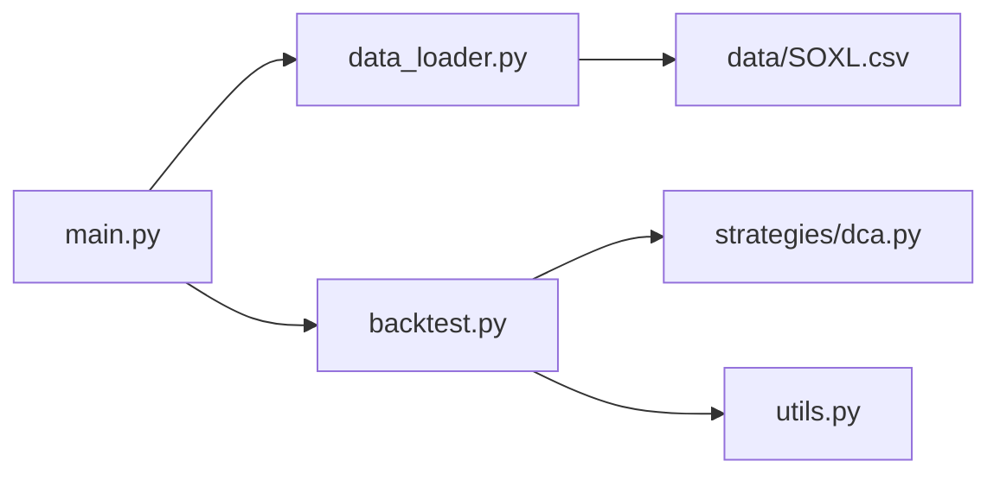

# SOXL 多层次 DCA 策略回测实现方案

## 整体架构



## 模块职责

### 1. data_loader.py - 数据加载

使用 Python 标准库 csv 模块读取 SOXL.csv，返回日期排序的数据列表。

核心函数：
- `load_data(filepath, start_date=None, end_date=None)` - 加载并过滤数据

数据结构（每行）：
```python
{"date": "2010-03-12", "open": 39.66, "high": 39.92, "low": 38.65, "close": 38.65}
```

### 2. strategies/dca.py - DCA 策略

实现每日交易逻辑，计算当日成交的订单。

核心函数：
- `execute_day(open_price, low_price, fee_rate=0.01)` - 返回当日所有成交订单

订单配置（硬编码在策略中）：

| 类型 | 价格系数 | 股数 |
|-----|---------|-----|
| 市价单 | 1.0 | 0.7 |
| 限价单 | 0.98 | 0.4 |
| 限价单 | 0.95 | 0.25 |
| 限价单 | 0.90 | 0.15 |

### 3. backtest.py - 回测引擎

遍历每日数据，调用策略执行，累计持仓和成本，计算最终指标。

核心函数：
- `run_backtest(data)` - 执行回测，返回结果字典

跟踪状态：
- `total_shares` - 累计持股
- `total_cost` - 累计成本（含手续费）
- `daily_values[]` - 每日市值（用于计算最大回撤）

输出指标：总投入成本、总持股、期末市值、总收益、总收益率、年化收益率、最大回撤、平均持仓成本

### 4. utils.py - 工具函数

- `calc_max_drawdown(values)` - 计算最大回撤
- `calc_annualized_return(total_return, days)` - 计算年化收益率

### 5. main.py - 程序入口

使用 argparse 处理命令行参数，串联各模块，格式化输出结果。

```bash
python main.py --start-date 2020-01-01 --end-date 2024-12-31
```

## 实现要点

1. **手续费计算**：`实际支出 = 成交金额 * (1 + 0.01)`
2. **限价单成交判定**：`low_price <= open_price * 价格系数`
3. **最大回撤**：基于每日持仓市值（当日收盘价 * 累计持股）计算
4. **年化收益率**：`(1 + 总收益率) ^ (365 / 天数) - 1`

## 文件修改清单

| 文件 | 操作 | 状态 |
|-----|------|------|
| `src/data_loader.py` | 新增数据加载函数 | ✅ 完成 |
| `src/strategies/dca.py` | 新增 DCA 策略逻辑 | ✅ 完成 |
| `src/backtest.py` | 新增回测引擎 | ✅ 完成 |
| `src/utils.py` | 新增工具函数 | ✅ 完成 |
| `main.py` | 新增程序入口 | ✅ 完成 |
| `requirements.txt` | 无需修改（使用标准库）| - |


