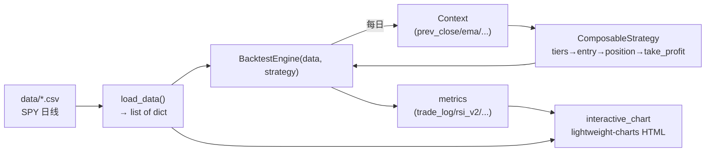
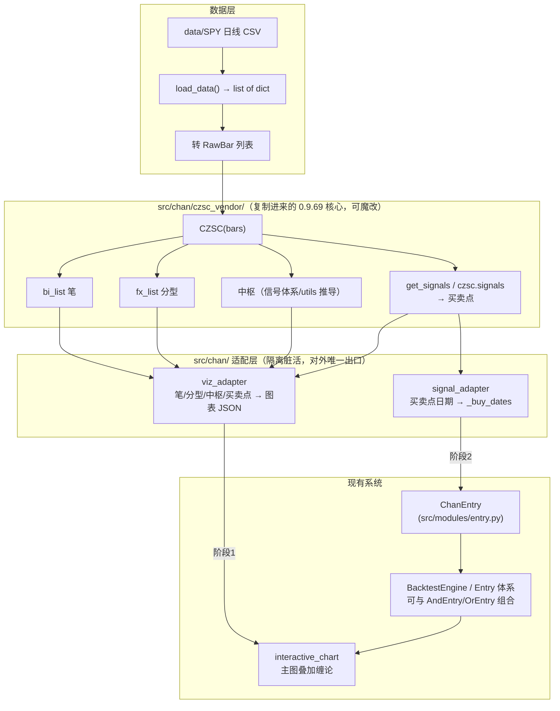

# czsc 缠论接入架构图

> 配套文档：同目录 `plan.md`（主方案与分阶段计划）。本文件只画架构与数据流，讲清楚 czsc 怎么嵌进现有系统。

## 1. 现状：项目现有数据流



关键事实：
- 所有 Entry（`VIXEntry`/`BreadthEntry` 等）模式统一：**构造时预计算 `_buy_dates` 集合**，`should_market_buy(context)` 查 `context.day['date'] in self._buy_dates`。
- `AndEntry`/`OrEntry` 可把任意两个 Entry 组合。
- 图表叠加靠 `addLineSeries`（线）+ `setMarkers`（标记），已有 breadth 背离连线作为先例。

## 2. 接入后：czsc（vendored 0.9.69）作为旁路计算层



## 3. 目录组织（vendored）

```
src/chan/                      ← 缠论功能总目录（新增）
├── __init__.py                ← 对外统一出口（项目其它代码只 import 这里）
├── czsc_vendor/               ← 从 czsc 0.9.69 复制来的核心源码（魔改战场）
│   ├── analyze.py             ← 缠论核心：分型/笔/中枢算法（主要改这里）
│   ├── objects.py             ← FX/BI/ZS/RawBar 数据结构
│   ├── enum.py                ← Freq/Mark/Direction 等枚举
│   └── ...（必要 utils）
├── viz_adapter.py             ← czsc 对象 → 图表 JSON（阶段1）
└── signal_adapter.py          ← czsc 买卖点 → _buy_dates（阶段2）
```

**隔离原则**：`interactive_chart.py` / `entry.py` 只依赖 `src/chan/` 适配层，绝不直接 import `czsc_vendor` 内部。将来魔改或替换 `czsc_vendor`，只要适配层接口不变，项目其它部分零改动。

## 4. 接入点

| 接入点 | 新增模块 | 作用 | 阶段 |
| --- | --- | --- | --- |
| 缠论核心 | `src/chan/czsc_vendor/` | vendored 0.9.69，可自由魔改 | 阶段 0 |
| 可视化 | `src/chan/viz_adapter.py` | czsc 对象 → 图表 JSON | 阶段 1 |
| 信号 | `src/chan/signal_adapter.py` + `src/modules/entry.py` 的 `ChanEntry` | 买卖点 → `_buy_dates`，复用 Entry 协议 | 阶段 2 |

## 5. 设计原则（与 CLAUDE.md 对齐）

- **czsc 走旁路**：不改 `BacktestEngine` 核心，缠论计算独立成 `src/chan/` 子包，失败可整体摘除。
- **vendored 可魔改**：核心源码在 `src/chan/czsc_vendor/`，随项目 git 管理，按自己理解自由升级。
- **适配层隔离**：项目其它代码只依赖 `src/chan/` 出口，不直接碰 `czsc_vendor` 内部。
- **遵循引擎路径**：信号通过 `ChanEntry`（标准 Entry 协议）进引擎，不走废弃的 `main.py`。
- **标识符英文、注释中文**：`ChanEntry`/`viz_adapter` 等用英文，注释文档用中文。
- **数据仅 SPY 日线**：第一版只接日线单级别，不做多级别联立。
