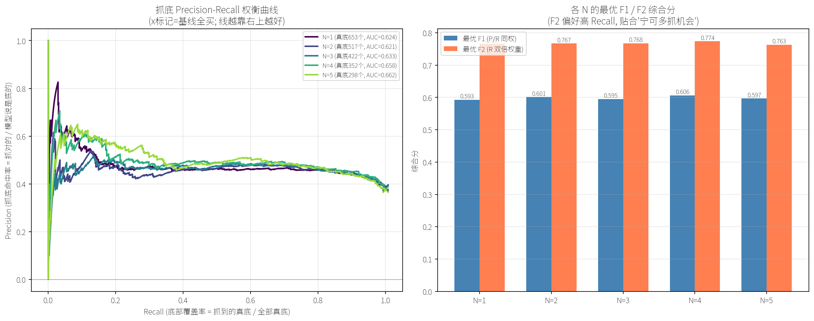
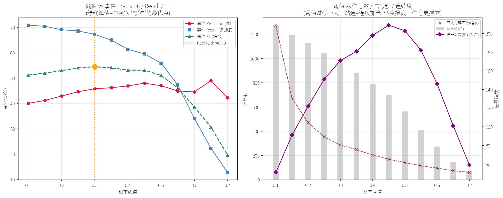

# 抓底 ML 模型诊断报告：为什么叠加 ML 后收益没增益，以及 NDay 门槛该取几

> 日期：2026-06-26
> 背景：第二阶段叠加 XGBoost 抓底模型后，回测 ROI 增益很小甚至微降。本报告从第一性原理出发，定位根因、纠正评估方法、给出门槛建议。
> 所有实验均为只读（walk-forward 样本外，monkey-patch 复用训练逻辑，不改生产代码）。复现脚本见 `ml/research/`。

---

## 0. 一句话结论

1. **"ROI 没增益"不是 ML 的锅，是评估尺子用错了**——SPY 长牛，买越多越赚，任何"减少买入"的过滤器都会系统性拉低收益率。用抓底命中率（Precision）评估，ML 是**有效**的（基线 ~38% → ML 放行 46~58%）。
2. **NDay 门槛 N 对"抓底质量"影响很小**（各 N 的 P-R 曲线高度重叠），真正的差异是**机会总量**：N=1 候选池有 653 个真底，N=5 只剩 298 个，门槛在源头过滤掉了一半底部机会（压低 Recall 上限）。
3. **推荐 N=2 或 N=3**：抓底质量与 N=5 基本一致，但保留远多于 N=5 的底部机会，契合"宁可多抓、不愿错过"的 DCA 风格。
4. **XGBoost 无需特征分箱**；阈值不该用 0.5（详见 §5）。
5. **阈值推荐区间 [0.30, 0.45]**（事件级第一性原理，详见 §8）。反直觉关键发现：**阈值过低（如 0.1）反而造成最严重的连续加仓**（底部区域连续 25 天天天报底），适度抬高阈值让信号回归稀疏。

---

## 1. 系统结构与问题

两阶段漏斗：

```
阶段1（规则过滤 NDayConfirmEntry）：连续 N 天收盘 < EMA20  → 候选信号日
阶段2（ML 概率过滤 OOSProbaEntry）：候选里用模型概率再筛一道  → 最终入场
```

ML 叠加要产生正增益，数学前提是：**在阶段1候选集合里，ML 概率能有效区分"好信号 vs 坏信号"**。
观察到的现象：叠加后 ROI 几乎不变、甚至微降。

---

## 2. 第一性原理：三种可能根因

| 根因 | 机制 | 改 NDay 门槛能解决吗 |
|------|------|:---:|
| A. 样本太少 | 门槛太严 → 候选太少 → ML 学不动 | 可能 |
| B. 阶段1太纯/与标签共线 | 候选高度同质，ML 无可分空间 | 否 |
| C. 评估目标错位 | 用收益率评判"抓底"模型，但长牛里抓底≠高收益 | 否（要换尺子） |

---

## 3. 诊断实验与数据

### 3.1 排除"样本太少"（根因 A 不成立）

`ml/research/diag_threshold_quality.py` 输出（SPY 1993~2026，8408 个交易日）：

| 门槛 N | 信号数 | 占比 | 20日远期收益 | 胜出基准 |
|---:|---:|---:|---:|---:|
| 1 | 2844 | 33.8% | +1.13% | +0.21% |
| 2 | 2230 | 26.5% | +1.23% | +0.31% |
| 3 | 1839 | 21.9% | +1.33% | +0.41% |
| 5 | 1326 | 15.8% | +1.57% | +0.65% |
| 7 | 981 | 11.7% | +1.79% | +0.87% |

- 样本充足（N=5 仍有 1326 个信号），**排除根因 A**。
- 门槛越高，信号"远期收益质量"越好（单调），说明门槛本身在做正事。
- **池内可分性**（用未来收益做"完美 ML"上界）：各 N 池内"上半 vs 下半"价差达 8~9pp，**说明池子里好坏混杂、可分空间大，排除根因 B（不是太纯）。**

### 3.2 用收益率评估 ML —— 得出"没用"的错误结论

`sweep_ndays`（已废弃）：对每个 N，A（全信号）vs B（ML 过滤）回测。

| N | A总收益 | B总收益 | Δ收益 |
|---:|---:|---:|---:|
| 1 | 203.4% | 195.4% | -8.1% |
| 3 | 197.5% | 185.9% | -11.6% |
| 5 | 202.3% | 190.0% | -12.2% |

每个 N 的 ML 过滤都让收益**下降**。但这是因为 ML 砍掉一半买入（如 N=5：786→385），而 SPY 长牛里"少买=少赚"。**这是对"抓底"目标不公平的尺子 → 根因 C：评估方法错了。**

### 3.3 改用抓底 Precision 评估 —— 结论反转，ML 有效

`ml/research/sweep_ndays_precision_recall.py`。真值 GT = `sl_proximity` 标签（swing low ± k 天，k=3）。

| N | 候选 | 基线P（不用ML） | AUC | 阈值放行P（提升） | Top10%P（提升） |
|---:|---:|---:|---:|---:|---:|
| 1 | 1701 | 38.4% | 0.624 | 46.2% (+7.8) | 52.4% (+14.0) |
| 3 | 1101 | 38.3% | 0.633 | 48.2% (+9.9) | 50.9% (+12.6) |
| 5 | 795 | 37.5% | 0.662 | 49.6% (+12.1) | 58.2% (+20.7) |

- 基线抓底命中率 ~38%，ML 高概率放行后提升到 46~58%（+8~21pp）。
- **ML 确实在抓底**，只是这种价值无法用收益率体现。

### 3.4 加入 Recall —— 揭示门槛的真正代价

| N | 候选池真底总数 | Top20% 抓到的真底 |
|---:|---:|---:|
| 1 | **653** | 157 |
| 5 | **298** | 85 |

**关键**：N 从 1→5，候选池里的"真底总数"从 653 暴跌到 298（-54%）。
→ NDay5 门槛在阶段1**就过滤掉了一半的底部机会**，这些机会 ML 根本无从抓起。
→ 这正是"N=5 会错过很多点位"的数据证据（Recall 上限被门槛压低）。

### 3.5 Precision-Recall 权衡曲线（最终决策依据）



`ml/research/plot_precision_recall.py` 产出。

| N | 真底数 | AUC | 最优F1 | 最优F2(偏recall) | F2点 P/R |
|---:|---:|---:|---:|---:|---|
| 1 | 653 | 0.624 | 0.593 | 0.766 | 41% / 97% |
| 2 | 517 | 0.621 | 0.601 | 0.767 | 41% / 99% |
| 3 | 422 | 0.633 | 0.595 | 0.768 | 42% / 96% |
| 4 | 352 | 0.658 | 0.606 | 0.774 | 43% / 97% |
| 5 | 298 | 0.662 | 0.597 | 0.763 | 41% / 97% |

读图要点：
- **左图五条 P-R 曲线高度重叠** → 相同 recall 下各 N 的 precision 几乎一样，**N 对抓底质量影响很小**。
- 真正的差异是曲线背后的**机会总量**（真底数 653 vs 298）。
- **右图 F1/F2 综合分高度接近**，N=4 微弱最高但差异在噪声级别。
- F2（偏 recall）最优点阈值都很低（0.11~0.15，近乎全放行），说明长牛+抓底场景天然偏向高覆盖。

---

## 4. 门槛 N 的建议

| 取向 | 推荐 N | 理由 |
|------|:---:|------|
| 宁可多抓、少错过（DCA 风格） | **N=2 或 N=3** | 抓底质量与 N=5 基本一致，但保留远多的底部机会；比 N=1 稍干净 |
| 准确优先、只在最有把握时重仓 | N=4~5 + 高概率 Top 区 | 单点 precision 略高，但机会数少一半 |

> 结论：**不必纠结小数点**。各 N 抓底质量曲线几乎重合，低 N 的核心优势是机会总量。结合"不喜欢 5、想多抓"的偏好，**N=2/3 是合理落点**。

---

## 5. 阈值机制澄清（为什么"没用 0.5"）

- XGBoost `.predict()` 默认用 0.5 切；但本项目**不调 `.predict()`**，而是用 `.predict_proba()` 取连续概率，**自定阈值**切。
- 现用阈值 = **折内训练集概率中位数**（`ml/eval_walkforward.py` 第 82-83 行）—— 动态、每折不同。
- 为什么不用 0.5：正样本率仅 ~38%（底部是少数类），模型概率整体偏低，绝大多数 < 0.5。用 0.5 切会几乎放行不出信号。中位数阈值 ≈ 放行概率最高的一半，是对类别不平衡的自适应处理。
- **阈值本质 = 在 P-R 曲线上选一个点**。想多抓 → 调低阈值（F2 最优在 0.11~0.15）；想精准 → 调高阈值。

---

## 6. 关于特征分箱（不建议）

- XGBoost 是树模型，每个节点自带最优切分点搜索（等价自适应分箱），**手动分箱反而丢失分辨率，通常降低性能**。
- v3 的 21 个特征中 8 个已是离散信号、13 个连续值，分箱收益更低。
- 分箱主要对线性模型（逻辑回归）有意义。

---

## 7. 真正的提升方向（天花板所在）

P-R 曲线显示各 N 的 precision 都压在 0.4~0.5、AUC 0.62~0.66 —— **ML 区分力有限是当前天花板**。
若要质的提升，方向不是调 N，而是：
1. **更强特征**（当前 AUC 0.66 偏弱，池内可分空间 8~9pp 没被吃满）。
2. **更强/更合适的模型或调参**。
3. 重新审视标签定义（k 值、sl_n 多尺度）。

---

## 8. 阈值如何确定：从"日级 F2"的错误到"事件级"的第一性原理

### 8.1 走过的弯路（重要，避免重蹈）

- **错误1：用日级 F2 找最优阈值，得出"0.11~0.15 最优"**。F2 只看日级 precision/recall，完全忽略"连续加仓"这一实盘约束。0.11 的阈值会让底部区域连续多天天天报信号 → 实盘上是连续加仓灾难。
- **错误2：建议"每个下跌簇只取概率最高的一天"**。这是 look-ahead bias —— 实盘站在今天，不知道明天概率涨跌，无法判断今天是不是"本簇最佳"。"最佳"只有事后回看才知道，**不可实盘执行**。

### 8.2 第一性原理：目的决定指标

目的 = **尽可能多、且尽可能准地预测局部低点**。两个关键推论：

1. **局部低点是稀疏、孤立的事件**。一段下跌里真正的底通常就一两天。所以好的抓底输出也应是稀疏的；连续一片报"是底"本身就违背物理事实。
2. **计量单位必须是"独立的真底事件"，不是"信号日"**。抓 100 个信号若挤在 5 个底里（每底报 20 天），实际只抓到 5 个底。对"别错过任何一个底"的目标，一个底抓到就算数，抓几次不加分。

→ 因此主指标改为**事件级 Precision / Recall**（口径与 GT 完全一致：真底 = `detect_swing_lows(sl_n=7)`，命中 = 信号落在真底 ±k=3 天内）：

- **事件 Recall** = 被信号覆盖的真底数 / OOS 真底总数 → "多抓底"
- **事件 Precision** = 落在真底 ±k 的信号数 / 总信号数 → "准"
- **信号簇数** = 连续信号并簇后的批次数 → 量化"连续加仓"程度（人工把关参考）

### 8.3 事件级阈值扫描结果（N=2, OOS 真底 220 个）

复现：`python -m ml.research.sweep_threshold_event --n 2`

| 阈值 | 信号数 | 信号簇 | 事件Precision | 事件Recall(抓到底数) | 事件F1 |
|---:|---:|---:|---:|---:|---:|
| 0.10 | 1272 | 51 | 40.0% | 70.9% (156) | 0.512 |
| 0.20 | 1126 | 122 | 42.9% | 69.1% (152) | 0.529 |
| **0.30** | 961 | 171 | 45.8% | 67.3% (148) | **0.545（峰值）** |
| 0.40 | 789 | 198 | 46.9% | 61.4% (135) | 0.532 |
| 0.45 | 698 | 209 | 48.0% | 59.5% (131) | 0.531 |
| 0.50 | 564 | 203 | 47.0% | 55.9% (123) | 0.511 |
| 0.65 | 149 | 101 | 49.0% | 22.3% (49) | 0.306 |



### 8.4 核心 Insight

1. **阈值最优在 0.30（事件 F1 峰值），不是 0.11，也不是默认 0.5。** 0.11 的事件 precision 仅 40%（假信号泛滥）；0.5 的 recall 已掉到 56%（漏掉太多底）。

2. **0.1→0.3 是"免费的午餐"**：提阈值让 precision 上升，recall 几乎不掉（71%→67%，仅 -4pp）。过了 0.3 才开始真正牺牲 recall。**0.30 是性价比拐点。**

3. **反直觉且最重要 —— 阈值过低反而导致最严重的连续加仓。** 阈值 0.10 时 1272 个信号仅 51 簇（平均每簇 **25 天**），底部区域一连 25 天天天报底。提高阈值把"黏连大片"打散成孤立信号（0.45 时 209 簇、每簇 ~3 天）。**这从数据证明：适度抬高阈值让信号回归稀疏，符合"局部低点本就稀疏"的本质，同时缓解连续加仓。**

4. **天花板仍在**：无论阈值怎么调，事件 precision 最高才 ~48%。调阈值只是在天花板下移动平衡点，真正的提升要靠增强模型（见 §7）。

### 8.5 阈值建议（区间，非单点）

**推荐阈值区间 [0.30, 0.45]**，把最终裁量权留给人工：

| 取向 | 阈值 | 效果 |
|------|:---:|------|
| 偏"多抓底" | 0.30 | 事件F1最高(0.545)，抓到 67% 真底，precision 46% |
| 偏"怕连续加仓" | 0.40~0.45 | F1 仅微降(~0.53)，信号被打得最散(每簇~3天)，recall 仍 60%+ |

> 注：本项目用纯阈值过滤，连续加仓由人工把关，故无需机器冷却期。

---

## 9. 落地：建立 v3_n2 生产模型 + 实测（卡 0.35 阈值）

### 9.1 阈值最终定论：实战钉死 0.35，不灵活变动

研究区间是 [0.30, 0.45]，但**实战必须固定一个数 = 0.35**。理由：
- 阈值若实战临时凭感觉调，等于人为引入事后偏见（会不自觉往"想加/不想加"方向调），信号失去客观性。
- **只有固定阈值才可被检验、可复盘。**
- 0.35 是甜点：事件 F1（0.540）几乎等于峰值（0.30 的 0.545），但 precision 更高、信号更稀疏，缓解连续加仓。

### 9.2 建立 v3_n2 版本（N=2 生产模型）

- `versions.py` 新增 `v3_n2`：沿用 v3 的特征/标签/模型参数，仅 `signal.n_days` 从 5 降为 2。
- 模型文件名改为按 n_days 动态命名：`spy_nday{n_days}_{version}`（v3 仍是 `spy_nday5_v3` 不受影响；v3_n2 是 `spy_nday2_v3_n2`），避免覆盖。
- `train_export.py` / `predict.py` 改为从版本配置读 `n_days`（信号判定、文件名、days_to_signal 全部跟随）。

**踩坑记录（重要）**：`train_export.train_and_export` 原本用 `get_active_config()` 读配置，**忽略了传入的 `--version` 参数** —— 导致传 `v3_n2` 仍按 ACTIVE_VERSION(v3) 训练（样本数错为 1324=N5 而非 2224=N2）。已修复为 `VERSIONS[version]`。教训：**version 参数必须贯穿"配置读取"，不能只用于文件命名。**

### 9.3 实测对比（6/25 收盘，剔除 6/26 盘中数据）

| | v3 (N=5) | v3_n2 (N=2) |
|---|---|---|
| 连续低于 EMA20 | 2 天 | 2 天 |
| 是否信号日 | ❌ 非信号日（需满5天） | ✅ **是信号日（满2天）** |
| 底部概率 | 11.3%（分布外,不可用） | **16.6%（有效）** |
| 卡 0.35 | — | 16.6% < 0.35 → **不加仓** |

**N=2 的核心价值实证**：6/25 在 N=5 下被一阶段直接过滤（非信号日，概率是分布外外推不可用）；在 N=2 下是合法信号日、模型给出有效概率。**N=2 让更多点位进入模型视野，正是"少错过机会"的体现。**

**结论**：6/25 概率 16.6% 远低于 0.35 阈值 → 当前不是底，不加仓。SHAP 显示主因是 RSI 未超卖（-0.58）+ 市场宽度健康（-0.48）。此结论与 MMA 结构判断、ML N=5 判断三方一致（跌得不够深/不够恐慌）。

---

## 附：复现命令

```bash
# 静态信号质量诊断（秒级）
python -m ml.research.diag_threshold_quality

# NDay 门槛 Precision/Recall 遍历
python -m ml.research.sweep_ndays_precision_recall --ns 1 2 3 4 5

# Precision-Recall 权衡曲线图
python -m ml.research.plot_precision_recall --ns 1 2 3 4 5

# 事件级阈值扫描（抓独立局部低点）
python -m ml.research.sweep_threshold_event --n 2

# 阈值 vs 事件Precision/Recall/信号簇 曲线图
python -m ml.research.plot_threshold_event --n 2
```
